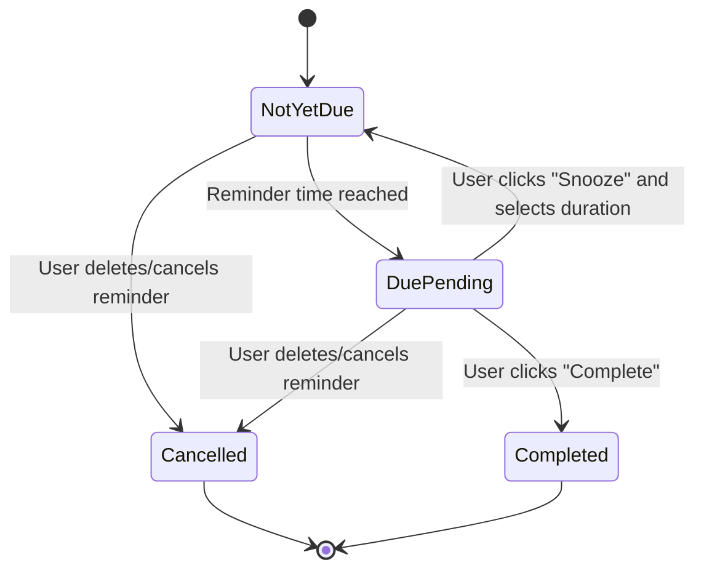
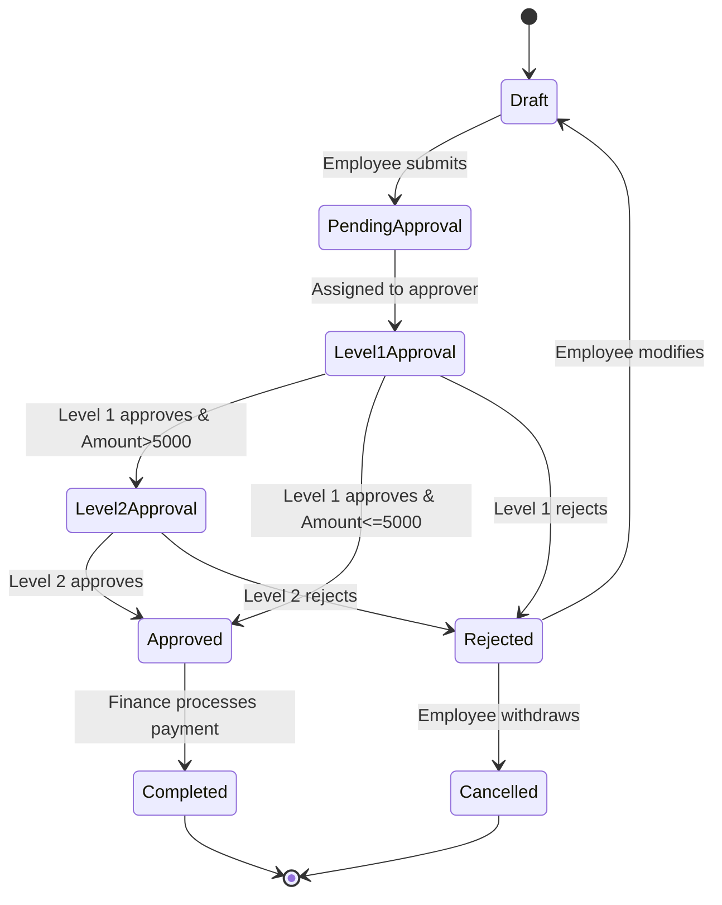

# Mermaid Diagram Examples (Requirements Perspective)

> Purpose: Use diagrams to clarify "flows/states/key interactions" to reduce ambiguity.
> Constraints: Stay at requirements level (user-visible behavior and system performance), don't write API paths, fields, HTTP codes, frameworks/libraries.
> **Complexity Control**: Single diagram suggested max 15-20 nodes. For complex flows, prioritize "drawing multiple diagrams by phase" rather than one giant diagram.

## Example 1: User Operation Flow (Flowchart)

Scenario: Mobile "One-time Reminder" complete loop from list to creation, trigger, and handling.

```mermaid
flowchart TD
  A[Enter reminder list] --> B{Is list empty?}
  B -->|Yes| C[Show empty state + guide "Create reminder" [Button: Create]]
  B -->|No| D[Show reminder list (with status: Not yet due/Due pending/Completed)]

  C --> E[Click "Create reminder" [Enter create page/modal]]
  D --> E

  E --> F[Fill in: Title + Time]
  F --> G[Click "Save" [Return to list]]
  G --> H[New reminder appears in list (Not yet due)]

  H --> I{Reminder time reached?}
  I -->|Yes| J[Trigger reminder: System notification + In-app popup (if in foreground)]
  J --> K{User choice}
  K -->|Complete| L[Mark as completed + Remove from pending]
  K -->|Snooze| M[Select snooze duration (e.g., 10/30 min) and reschedule reminder]
  K -->|Dismiss| N[Close popup; reminder stays as "Due pending" [Visible in list]]
```

## Example 2: State Machine (State Diagram)

Scenario: Single reminder state transitions (states "user can see/can verify").



## Example 3: Key Scenario Sequence (Sequence)

Scenario: "Permission prompt/degradation path" when creating reminder (emphasizing user-visible results, not implementation).

```mermaid
sequenceDiagram
  participant U as User
  participant A as App/Frontend
  participant OS as System (Notification Permission/Center)

  U->>A: Click "Create reminder"
  A-->>U: Show create form (title, time)
  U->>A: Fill in and click "Save"

  A->>OS: Request/check notification permission (abstract)
  alt Permission enabled
    OS-->>A: Allow
    A-->>U: Save success prompt; new reminder appears in list (Not yet due)
  else Permission disabled/denied
    OS-->>A: Deny
    A-->>U: Prompt "Notifications disabled, will only show due pending in list" (degradation note)
    A-->>U: Still save reminder; new reminder appears in list (Not yet due)
  end
```

---

## Example 4: B2B Backend Approval Flow (Flowchart)

Scenario: Enterprise internal "Expense Reimbursement Approval" complete flow from submission to approval completion (including rejection and resubmission).

```mermaid
flowchart TD
  A[Employee enters expense page] --> B[Fill expense info: Amount + Type + Attachment]
  B --> C[Click "Submit for Approval"]
  C --> D[System validation]

  D --> E{Validation passed?}
  E -->|No| F[Show error prompt (e.g., "Missing attachment")]
  F --> B

  E -->|Yes| G[Submission successful; status becomes "Pending Approval"]
  G --> H[Notify approver (system notification/email)]

  H --> I{Level 1 Approver action}
  I -->|Approve| J{Amount > 5000?}
  I -->|Reject| K[Status becomes "Rejected"; notify employee and show rejection reason]
  K --> L[Employee modifies and resubmits]
  L --> D

  J -->|No| M[Status becomes "Approved"; notify employee]
  J -->|Yes| N[Route to Level 2 approver; status becomes "Level 2 Approval in Progress"]

  N --> O{Level 2 Approver action}
  O -->|Approve| M
  O -->|Reject| K

  M --> P[Finance processes payment; status becomes "Completed"]
  P --> Q[End]
```

## Example 5: B2B Expense Report State Machine (State Diagram)

Scenario: Single expense report state transitions in the system (states visible to user and approver).



## Example 6: B2B Concurrent Approval Sequence (Sequence)

Scenario: Concurrent processing logic when approval requires "countersignature" (everyone must approve for pass).

```mermaid
sequenceDiagram
  participant E as Employee
  participant S as System
  participant A1 as Approver A
  participant A2 as Approver B
  participant A3 as Approver C

  E->>S: Submit expense report (Amount $8000)
  S-->>E: Submission successful; status "Pending Approval"

  S->>A1: Notify for approval (concurrent)
  S->>A2: Notify for approval (concurrent)
  S->>A3: Notify for approval (concurrent)

  A1->>S: Approve (1/3)
  S-->>E: Update progress "Approval in Progress 1/3"

  A3->>S: Approve (2/3)
  S-->>E: Update progress "Approval in Progress 2/3"

  A2->>S: Reject
  S-->>E: Status becomes "Rejected"; show rejection reason
  S-->>A1: Notify "Approval terminated"
  S-->>A3: Notify "Approval terminated"

  Note over E,S: Any one rejection rejects the whole,<br/>employee modifies and resubmits
```
