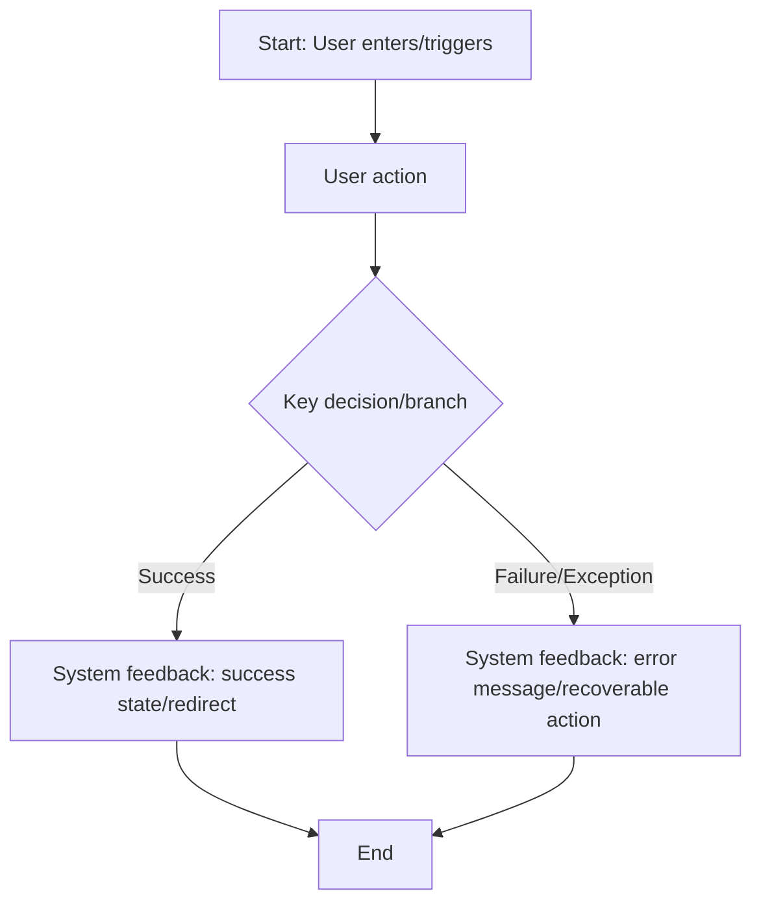
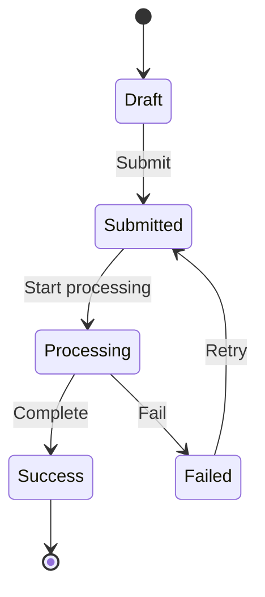
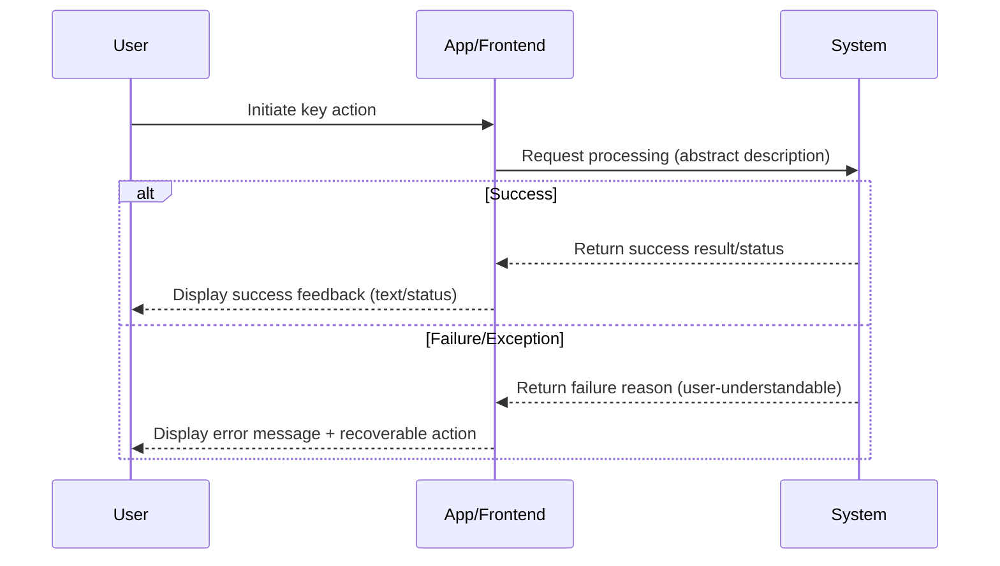

```markdown
# Product Requirements Document: [Project/Feature Name] - V[Version]

## 0. Product Strategy

### 0.1 Problem Definition
- **Core Problem**: (What problem to solve)
- **Target Users**: (For whom)
- **Current Pain Points**: (Users' current difficulties)

### 0.2 Value Hypothesis
| Value Type | Description |
|------------|-------------|
| User Value | (What benefits users get) |
| Business Value | (How it helps the business) |

### 0.3 Success Metrics
| Metric Name | Priority | Baseline | Target | Measurement Method |
|-------------|----------|----------|--------|-------------------|
| (Metric) | P0/P1/P2 | (Current value) | (Target value) | (How to measure) |

> Note: P0 metrics must be quantified; P1/P2 can be qualitative descriptions

### 0.4 Boundaries and Trade-offs

#### 0.4.1 In Scope
- (Feature scope for this iteration)

#### 0.4.2 Out of Scope (Rejected Requirements)
| Requirement Description | Rejection Reason | Include in Future Planning |
|------------------------|------------------|---------------------------|
| (Rejected feature) | (Why not doing) | Yes/No |

#### 0.4.3 Future Candidates
- (Features that might be done later)

## 1. Overview
### 1.1 Project Background & Core Problem
(Here fill in the clear description of the top-level problem, guided and confirmed by you with the user, providing global context)

### 1.2 Core Business Flow / User Journey Map
(Here fill in the phased business flow or user journey guided by you and finally confirmed by the user, serving as the directory and main line of the entire document)
1.  **Phase 1: [Name]** - [One-sentence description of user goal in this phase]
2.  **Phase 2: [Name]** - [One-sentence description of user goal in this phase]
...

### 1.3 Mermaid Diagrams (Flow/State/Sequence)
> Note: Mermaid diagrams are for "requirement alignment" to avoid ambiguity; avoid writing technical implementation details (don't write API paths, fields, HTTP codes, frameworks/libraries).

#### 1.3.1 User Operation Flow (Required)


#### 1.3.2 State Machine (Required when there's a clear state transition object)


#### 1.3.3 Key Scenario Sequence (Only fill in when "timing/concurrency/retry/timeout" affects user-visible results)


## 2. User Stories Detail

### Phase 1: [Phase Name]

---

#### **US-[Number]: [User Story Title, format: As a... I want to... So that...]**
*   **Value Statement**:
    *   **As a** [User role]
    *   **I want to** [Complete some action/Achieve some goal]
    *   **So that** [Realize some value/Solve some problem]
    *   **Value Type**: [ ] User Value  [ ] Business Value  [ ] Technical Debt
    *   **Priority**: P0 / P1 / P2
    *   **Success Metrics**: [P0 must be quantified, P1/P2 can be qualitative, or N/A]
*   **Business Rules & Logic**:
    1.  **Preconditions**: (Prerequisites for executing this feature)
    2.  **Operation Flow (Happy Path)**: (Step-by-step description of user actions and system feedback on the success path)
    3.  **Error Handling**: (Detailed list of various possible error scenarios, degradation/compensation strategies, and corresponding system behaviors)
*   **Acceptance Criteria**: (Use GIVEN-WHEN-THEN format, providing clear acceptance conditions for core scenarios, covering at least success and failure/exception paths)
    *   **Scenario 1: [Scenario Name]**
        *   **GIVEN** [Context/Preconditions]
        *   **WHEN** [User performs action]
        *   **THEN** [Expected system result]
    *   **Scenario 2: ...**
---
*   **Page Layout Wireframe (ASCII Wireframe)**: <!-- Required for stories involving UI -->
    ```text
    (Insert ASCII wireframe confirmed by user here)
    ```
---
*   **Product Decision Log**: <!-- Only fill in for important requirements -->
    *   **Decision Question**: [Key product decision this requirement involves]
    *   **Decision Result**: [What was chosen]
    *   **Reason**: [Why this choice was made]
    *   **Rejected Alternatives**: [Explicitly record alternatives not chosen and why]
---
(Next user story...)
```
