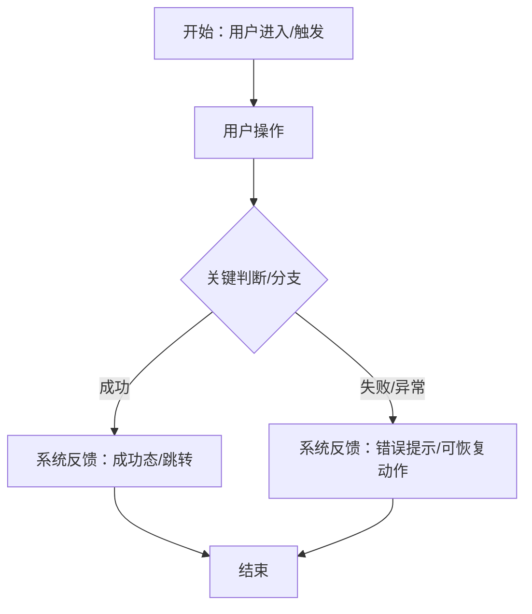
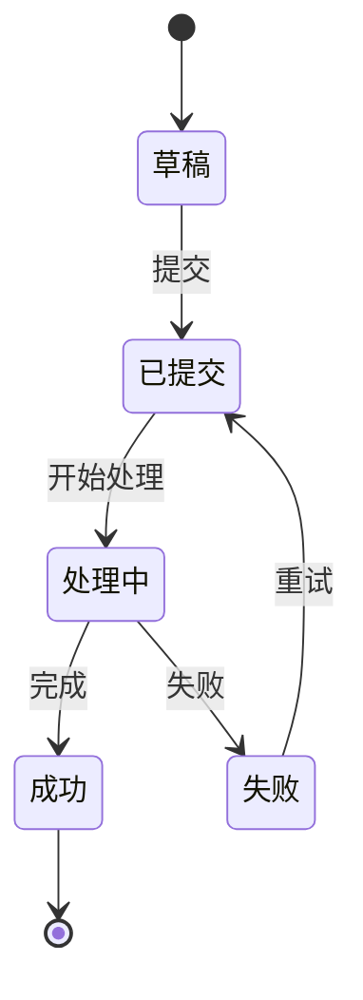
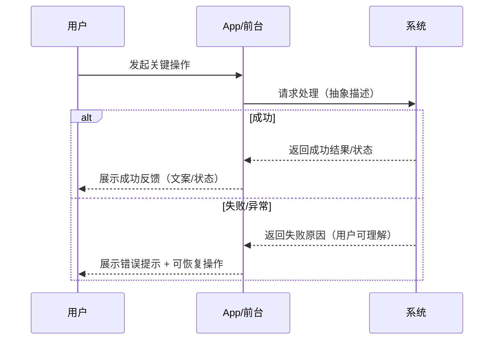

```markdown
# 产品需求文档：[项目/功能名称] - V[版本号]

## 0. 产品策略 (Product Strategy)

### 0.1 问题定义
- **核心问题**：(要解决什么问题)
- **目标用户**：(为谁解决)
- **当前痛点**：(用户当前的困扰)

### 0.2 价值假设
| 价值类型 | 描述 |
|---------|------|
| 用户价值 | (用户得到什么好处) |
| 业务价值 | (对业务有什么帮助) |

### 0.3 成功指标
| 指标名称 | 优先级 | 基线 | 目标 | 衡量方式 |
|---------|-------|------|------|---------|
| (指标) | P0/P1/P2 | (当前值) | (目标值) | (怎么衡量) |

> 注：P0 指标必须量化，P1/P2 可定性描述

### 0.4 边界与取舍

#### 0.4.1 本次包含
- (这次做的功能范围)

#### 0.4.2 本次不包含（拒绝的需求）
| 需求描述 | 拒绝理由 | 是否纳入后续规划 |
|---------|---------|-----------------|
| (被拒绝的功能) | (为什么不做) | 是/否 |

#### 0.4.3 后续候选
- (以后可能做的功能)

## 1. 综述 (Overview)
### 1.1 项目背景与核心问题
(此处填写经你引导和用户确认的，对顶层问题的清晰描述，提供全局上下文)

### 1.2 核心业务流程 / 用户旅程地图
(此处填写经你引导和用户最终确认的、分阶段的业务流程或用户旅程，作为整个文档的目录和主线)
1.  **阶段一：[名称]** - [一句话描述该阶段的用户目标]
2.  **阶段二：[名称]** - [一句话描述该阶段的用户目标]
...

### 1.3 Mermaid 图（流程/状态/时序）
> 说明：Mermaid 图用于“需求对齐”，避免歧义；避免写成技术实现细节（不要写 API 路径、字段、HTTP code、框架/库）。

#### 1.3.1 用户操作流（必填）


#### 1.3.2 状态机（当存在明确状态流转对象时必填）


#### 1.3.3 关键场景时序（仅当“时序/并发/重试/超时”影响用户可见结果时填写）


## 2. 用户故事详述 (User Stories)

### 阶段一：[阶段名称]

---

#### **US-[编号]: [用户故事标题，格式：作为...我希望...以便于...]**
*   **价值陈述 (Value Statement)**:
    *   **作为** [用户角色]
    *   **我希望** [完成某项操作/达到某个目的]
    *   **以便于** [实现某种价值/解决某个问题]
    *   **价值类型**: [ ] 用户价值  [ ] 业务价值  [ ] 技术债务
    *   **优先级**: P0 / P1 / P2
    *   **成功指标**: [P0必须量化，P1/P2可定性，或 N/A]
*   **业务规则与逻辑 (Business Logic)**:
    1.  **前置条件**: (执行此功能需要满足的前提)
    2.  **操作流程 (Happy Path)**: (一步步描述用户成功路径下的操作与系统反馈)
    3.  **异常处理 (Error Handling)**: (详细罗列各种可能出错的情况、降级/补偿策略以及对应的系统行为)
*   **验收标准 (Acceptance Criteria)**: (使用 GIVEN-WHEN-THEN 格式，为核心场景提供清晰的验收条件，至少覆盖成功与失败/异常路径)
    *   **场景1: [场景名]**
        *   **GIVEN** [上下文/前置条件]
        *   **WHEN** [用户执行的动作]
        *   **THEN** [期望看到的系统结果]
    *   **场景2: ...**
---
*   **页面布局线框图 (ASCII Wireframe)**: <!-- 对于涉及UI的故事，此项必填 -->
    ```text
    (此处插入经用户最终确认的ASCII线框图)
    ```
---
*   **产品决策记录 (Product Decision Log)**: <!-- 仅重要需求填写 -->
    *   **决策问题**：[这个需求涉及的关键产品决策]
    *   **决策结果**：[选择了什么]
    *   **理由**：[为什么这样选择]
    *   **拒绝的方案**：[明确记录没有选择的方案及原因]
---
(下一个用户故事...)
```
